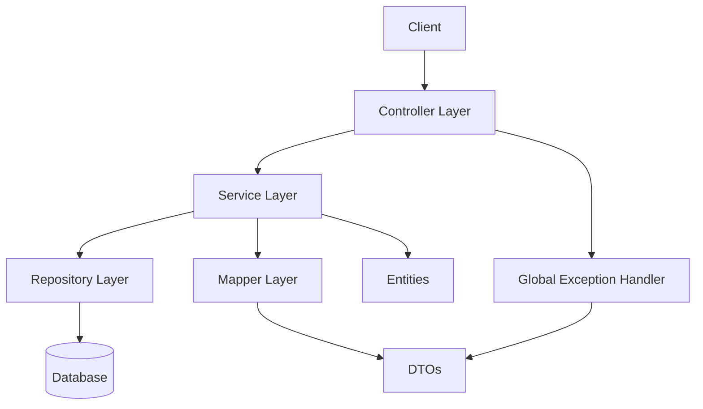
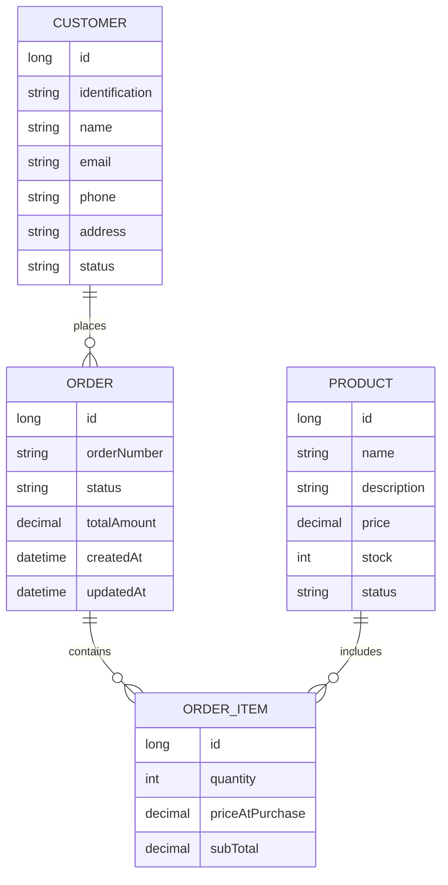
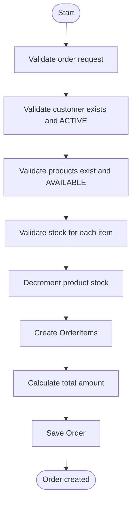
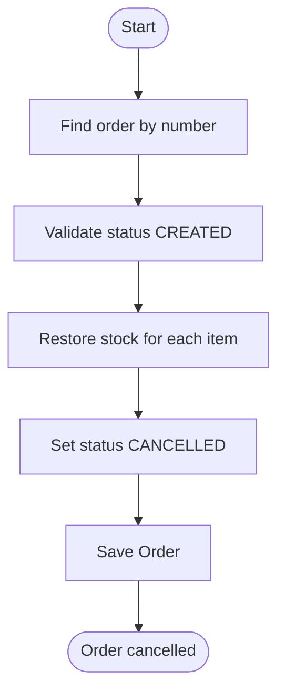

# Order Management System

## 1. Project Title
Order Management System

## 2. Project Description
A Spring Boot backend that manages Customers, Products, and Orders using a layered architecture. The system enforces business rules such as customer activation, product availability, and stock validation. It provides REST APIs with standardized error responses, pagination, and comprehensive unit/controller tests.

## 3. Architecture Overview
Layered architecture with clear separation of concerns:
- Controller
- Service
- Repository
- DTO
- Mapper
- Entity
- Exception Handling

### Architecture Diagram


## 4. Technologies Used
- Java 17+
- Spring Boot
- Spring Data JPA
- Lombok
- MapStruct
- JUnit 5
- Mockito
- Maven
- H2 (default) or PostgreSQL
- REST API

## 5. Project Structure
```
src/
  main/
    java/com/example/ordersmanagement/
      controller/
      service/
      service/impl/
      repository/
      dto/
      mapper/
      entity/
      exception/
      util/
    resources/
      application.yaml
  test/
    java/com/example/ordersmanagement/
      controller/
      service/impl/
      exception/
```

## 6. Entity Model Description
- **Customer**: Buyer entity with status (ACTIVE/INACTIVE).
- **Product**: Sellable item with status (AVAILABLE/UNAVAILABLE/OUT_OF_STOCK) and stock.
- **Order**: Purchase order with status (CREATED/CANCELLED/PAID) and total amount.
- **OrderItem**: Item within an order, storing quantity and price at purchase.

### Entity Diagram


## 7. Business Rules
| Rule | Description |
|---|---|
| Customer must be ACTIVE | Inactive customers cannot place orders |
| Product must be AVAILABLE | Unavailable products cannot be ordered |
| Order must contain items | Empty orders are rejected |
| Validate stock before order | Insufficient stock is rejected |
| Reduce stock on order create | Stock is decremented on successful order |
| Restore stock on cancel | Stock is incremented when an order is cancelled |
| Deactivate customers and products | Deactivated resources cannot be used in new orders |

## 8. API Endpoints
**Base Path:** `/api/v1`

### Customers
| Method | Endpoint | Description | Success | Error Codes |
|---|---|---|---|---|
| POST | /customers | Create customer | 201 | CUSTOMER_ALREADY_EXISTS, CUSTOMER_EMAIL_ALREADY_EXISTS, VALIDATION_ERROR |
| GET | /customers | List customers (paginated) | 200 | INTERNAL_SERVER_ERROR |
| GET | /customers/{identification} | Get customer by identification | 200 | CUSTOMER_NOT_FOUND |
| PUT | /customers/{identification} | Update customer | 200 | CUSTOMER_NOT_FOUND, CUSTOMER_INACTIVE, VALIDATION_ERROR |
| PATCH | /customers/{identification} | Deactivate customer | 204 | CUSTOMER_NOT_FOUND, CUSTOMER_ALREADY_INACTIVE |

### Products
| Method | Endpoint | Description | Success | Error Codes |
|---|---|---|---------|---|
| POST | /products | Create product | 201     | INVALID_STOCK, VALIDATION_ERROR |
| GET | /products | List products (paginated) | 200     | INTERNAL_SERVER_ERROR |
| GET | /products/{id} | Get product by id | 200     | PRODUCT_NOT_FOUND |
| PUT | /products/{id} | Update product | 200     | PRODUCT_NOT_FOUND, PRODUCT_UNAVAILABLE, INVALID_STOCK, VALIDATION_ERROR |
| PATCH | /products/{id} | Deactivate product | 204     | PRODUCT_NOT_FOUND, PRODUCT_ALREADY_UNAVAILABLE |

### Orders
| Method | Endpoint                          | Description | Success | Error Codes |
|---|-----------------------------------|---|---------|---|
| POST | /orders                           | Create order | 201     | EMPTY_ORDER, CUSTOMER_NOT_FOUND, CUSTOMER_INACTIVE, PRODUCT_NOT_FOUND, PRODUCT_UNAVAILABLE_FOR_ORDER, INSUFFICIENT_STOCK, VALIDATION_ERROR |
| GET | /orders                           | List orders (paginated) | 200     | INTERNAL_SERVER_ERROR |
| GET | /orders/{orderNumber}             | Get order by number | 200     | ORDER_NOT_FOUND |
| GET | /orders/customer/{identification} | Orders by customer identification | 200     | CUSTOMER_NOT_FOUND, CUSTOMER_INACTIVE |
| PATCH | /orders/{orderNumber}/cancel      | Cancel order | 200     | ORDER_NOT_FOUND, INVALID_ORDER_STATUS |

## 9. Example JSON Requests and Responses
### Create Customer
```json
{
  "identification": "1234567890",
  "name": "John Doe",
  "email": "john@example.com",
  "phone": "+1-555-0100",
  "address": "123 Main St"
}
```

### Create Product
```json
{
  "name": "Mechanical Keyboard",
  "description": "Brown switches",
  "price": 79.99,
  "stock": 50
}
```

### Create Order
```json
{
  "customerIdentification": "1234567890",
  "items": [
    { "productId": 1, "quantity": 2 },
    { "productId": 2, "quantity": 1 }
  ]
}
```

### Example Success Response (Order)
```json
{
  "orderNumber": "ORD-00001",
  "customerId": 1,
  "status": "CREATED",
  "totalAmount": 239.97,
  "createdAt": "2026-03-06T12:31:30",
  "updatedAt": "2026-03-06T12:31:30",
  "items": []
}
```

## 10. Error Handling
All errors return a standardized response:
```json
{
  "timestamp": "2026-03-06T12:31:30.123",
  "status": 400,
  "error": "Insufficient stock for product X",
  "errorCode": "INSUFFICIENT_STOCK",
  "path": "/api/v1/orders"
}
```

See `docs/ERROR_CODES.md` for the full error code catalog and mappings.

## 11. Running the Project
**Prerequisites**
- Java 17+
- Maven 3.9+

**Run (Maven)**
```bash
mvn spring-boot:run
```

**H2 Console (default)**
- URL: `http://localhost:8080/h2-console`
- JDBC URL: `jdbc:h2:mem:ordersdb`
- User: `sa` / Password: `sa`

## 12. Running Tests
```bash
mvn clean test
```

**Coverage (Jacoco)**
```bash
mvn clean test jacoco:report
```
Report: `target/site/jacoco/index.html`

## 13. Future Improvements
- Add authentication/authorization (JWT/OAuth2)
- Add API documentation with OpenAPI/Swagger examples
- Add integration tests with Testcontainers (PostgreSQL)
- Add observability (metrics, tracing, structured logging)
- Improve pagination responses using Spring HATEOAS

## Order Creation Flow


## Order Cancellation Flow
